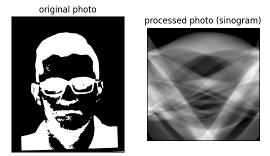
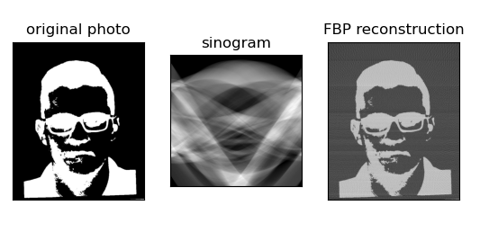

# Radon_transform
#### method for radon transform
#### Name: Zhornichenko Ilya Alekseevich
#### Group: TMSS

### Вычислительная ниткография 

####  Отчет по домашнему заданию №1

- Репозиторий содержит реализацию метода вычислительной рентгеновской томогорафии 
(BPT), в основе которого лежит метод интегрального преобразования Радона. В 
репозитории представлены методы томографической реконструкции FBP с предварительным 
пропрежеванием изображения.

#### Особенности метода

- Подается на вход изображение в отттенках серого. В программе также реализован метод crop для исключения неквадратных изображений

### Sinogram

### Filtered backprojection

### Ramp filter result

**Zhornichenko Ilya**
